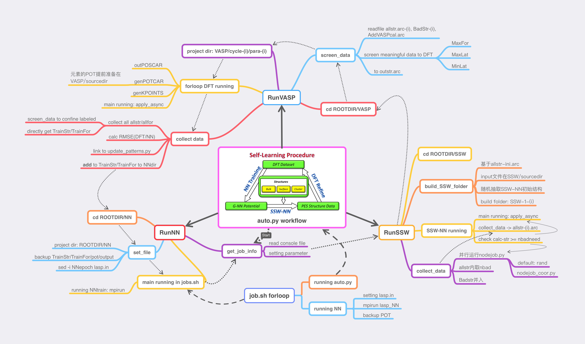
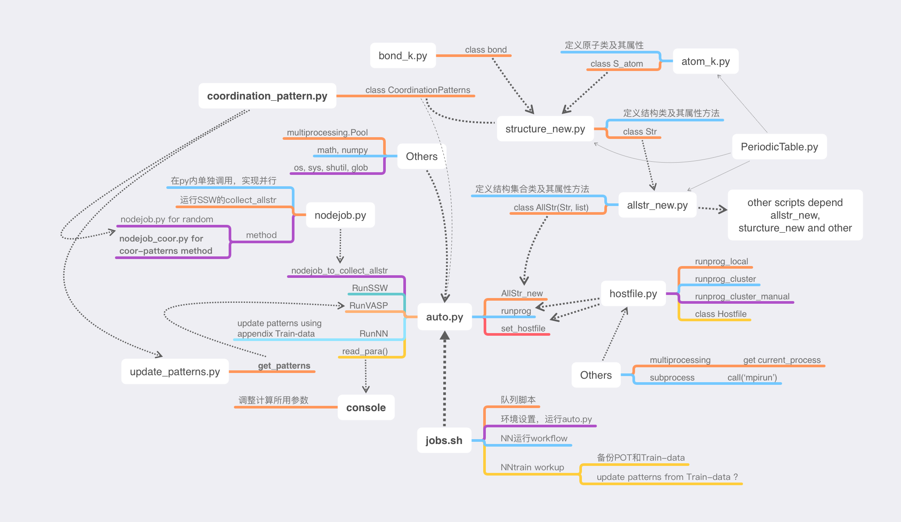

# LASP SSW-DFT-NN auto-train python-lib

## Author
Modified: James.Misaka.Bourbon.Liu

Original: ZPLiu's Group (SDHuang, SCMa, ZPLiu et. al.)

Last Update: 2023-02-11

Version: V1.2.6

## Update log

V1.2.6: 
1. Script Traindata_analysis_more.py for give the full infomation of TrainStr.txt and TrainFor.txt
2. Script Traindata_analysis_more_para.py for parallel doing infomation subtraction
3. bug fixed of allstr_new.py and sturcture_new.py

## Program Structure






## Requirement

Python 3.6+ (better 3.8)

NumPy, matplotlib, Pandas. Scipy, multiprocessing et. al.

Miniconda or Anaconda to construct Python-3.8 env is recommended

Original LASP_PythonLib use Python-2.7, which is TOTALLY OUT-Of-DATE

## Function

1. SSW-NN-autotrain Machine Learning Potentials of LASP.
2. python (and shell/fortran) scripts which can be used in LASP Calculation. e.g:
   1. vasp2lasptrain.py transfer VASP-label result to TrainStr.txt and TrainFor.txt. (independently)
   2. shiftformat.py transfer between arc-file and Traindata-file. (independently)
   3. traindata_analysis.py to give infomation of TrainStr.txt and TrainFor.txt.
   4. splitarc_auto.py to split muti-struc-arcfile to each input.arc(lasp.str) or DFT_label_inputfile.
   5. pos_arc_shift.py transfer between POSCAR and struc-arc-file.
   6. shellscript in little_script dir.
   7. computeQ.py for calculate dafa for PlotQE usage.

## Scripts related to files manipulation of LASP jobs

1. related to traindata
   1. shiftformat.py: arc2train or train2arc usage (independent)
   2. vasp2lasptrain.py: vasp-dft result directly to TrainStr.txt and TrainFor.txt (independent)
   3. cut_traindata.py: cut TrainStr/TrainFor by
   4. traindata_analysis.py: print-out basic statistic infomation of TrainStr/TrainFor, which can have overview.
   5. traindata_analysis_more(_para).py: print-out full infomation of TrainStr/TrainFor, which can be used for SI.
2. related to arc_data
   1. findGM.py: find top100 (can be set) global minimum structure from SSW result
   2. splitarc_auto.py: split all-str arc file to one-str arc file (or dft-project dir), for doing LASP or VASP
   3. nodejob.py and nodejob_coor.py: collect all-str from SSW to VASP-DFT
   4. collect_vasp_label.py: collect and screen all-str from SSW to VASP-DFT (not test)
   5. screen_data.py: from auto.py, used to screen all-str from SSW result (not test)
3. related to coordination patterns
   1. dft_setting dir: used for coor_verlet_sample.py
   2. coor_verlet_sample.py: two-steps dynamic verlet sampling based on stucture similarity described by coordination patterns
   3. update_patterns(_parallel).py: generate coordination patterns of all-str (and add to exist database)

## Main Function of Scripts: Run SSW-NN-autotrain and auto.py

### 1. modify console file

#### 1.1 some following are parameters often need to change

```shell
StartfromVASP 0   # 0 start from SSW sampling provided with NN pot , 1 start from allstr.arc-0 in VASP dir, which is often used to train the first NN pot
Nbad   40    # structures for VASP every cycle
cpupernode 96   # CPU total core (not suggested running between 2 or more CPUs)
SSWcheckcycle  600   # SSW time clock 600 seconds

%block cpuperjob
SSW  24         # cores per SSW job
VASP 24         # cores per VASP job
NN   0          # should be designated in jobs.sh
%endblock cpuperjob
```

#### 1.2 provide the binary program

```sh
%block prog
SSW  /home10/bin/lasp-1.0-release/lasp
VASP  /home10/bin/lasp-1.0-release/lasp
VASPgamma  /home10/bin/lasp-1.0-release/lasp.gamma
NN  /home10/bin/lasp-1.0-release/lasp
%endblock prog
```

#### 1.3 provide the element name in console file

```sh
%block base
O   0.0
H   0.0
%endblock base
```

### 2. modify jobs.sh

1. make sure the name of NN pot is correct, e.g. sed -i 's/H2O/PtOH.pot/g' jobs.sh
2. modify the number of cycles, default is 100, in: for i in {1..100}
3. modify the cpu/cores required for your computing cluster (modify it in jobs.sh)

### 3. create arc file for SSW sampling:  allstr-ini.arc
   in SSW/sourcedir/allstr-ini.arc

   you may get allstr-ini.arc from the examples of structure which you need to add and train in your pot


### 4. check NN directory
   In rootdir/NN you should prepare:

```shell
   lasp.in   # lasp_NNtrain input file
   H2O.pot          # not required if start from scratch
   H2O.input        # if start from scratch, use "newrun" for pot
   TrainStr.txt     # if start from scratch, just creat an empty file
   TrainFor.txt     # if start from scratch, just creat an empty file
   adjust_factor  # can ignore
```

lasp already has a lot of Train*.txt files for different systems please first download TrainStr.txt TrainFor.txt from www.lasphub.com

### 5. make sure add python exec path in jobs.sh

You'd better have anaconda env in your server, otherwise you can use intel-python:

You can use intel-python by define it in .bashrc:

```sh
export PYTHONPATH=/data/apps/intel/intelpython3/bin:$PYTHONPATH
```

### 6. qsub jobs.sh (or sbatch jobs_local.slurm)


## some tips

1. SSW/sourcedir have input.i for SSW-NN input file, may need to check
2. remember check SSW VASP NN dir before finally running
3. Remember check auto.py(SSW_choosing_mode) and jobs.sh before qsub/sbatch
4. Coordination-Patterns method waiting for using
5. auto.py and SSW-DFT-NN auto still need to be tested
